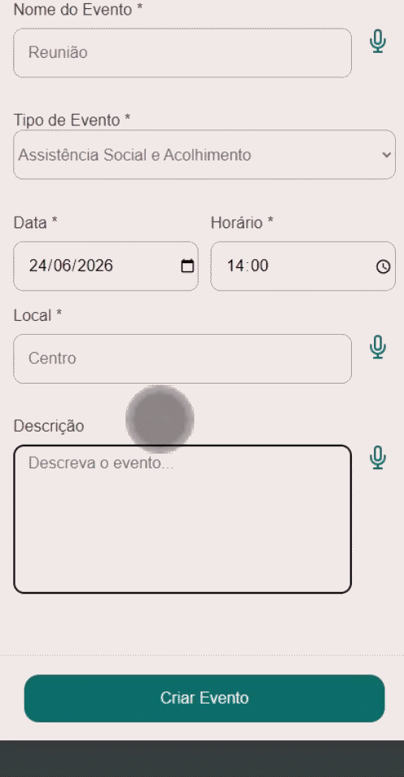
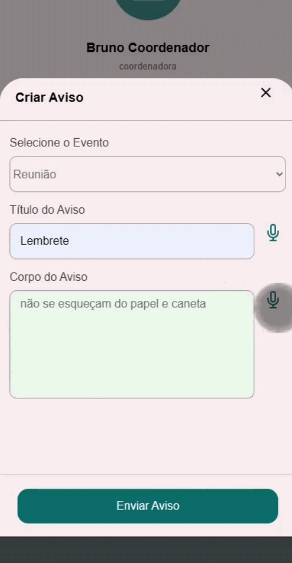

# <div align="center"> Aplicativo MaMobi </div>

## Uma plataforma de organização de eventos comunitários com suporte a notificações.

<div align="center">

[](https://github.com/brunoabreuco/maes-mobilizadoras/commits)
[](https://github.com/brunoabreuco/maes-mobilizadoras/issues)
[](https://github.com/brunoabreuco/maes-mobilizadoras)
[](https://github.com/brunoabreuco/maes-mobilizadoras)


</div>

---

### Sobre o projeto

Este WebApp é uma plataforma de gestão de ações comunitárias, desenvolvida como projeto de extensão universitária pela UNIFESP. O desenvolvimento foi inspirado nas Mães Mobilizadoras de Parelheiros, extremo sul de São Paulo, e os requisitos foram levantados a partir das informações públicas disponíveis em [Cuidados - IBEAC](https://ibeac.org.br/nossa-atuacao/cuidados/)

As Mães Mobilizadoras são um coletivo de mulheres residentes em seis bairros da região (Barragem, Colônia, Jardim Silveira, Nova América, São Norberto e Vargem Grande) que mobilizam a comunidade para o cuidado com gestantes e a primeira infância. O grupo atua sob supervisão do [IBEAC (Instituto Brasileiro de Estudos e Apoio Comunitário)](http://www.ibeac.org.br), ONG presente em Parelheiros desde 2008, em parceria com o CPCD (Centro Popular de Cultura e Desenvolvimento).

Embora tenha sido concebido a partir dessa realidade, o aplicativo não é exclusivo para esse grupo e pode ser adaptado para outras organizações comunitárias.

---

### Funcionalidades-Chave

- Calendário com marcações coloridas correspondentes às datas dos eventos cuja presença foi confirmada pelo usuário.
- Lista de todas as ações comunitárias cadastradas e suas informações detalhadas, com opções de confirmar ou cancelar participação.
- Tela exclusiva para notificações relevantes, como novas ações e lembretes.
- Tela de perfil com as estatísticas de participação do usuário.

O aplicativo conta com funcionalidades adicionais para membros da associação:

- Criar novos eventos (nome, tipo, data, horário, local e descrição).
- Enviar notificações e atualizações dos eventos.
- Coordenadoras podem conceder status de organizadora para uma usuária comum, liberando as funcionalidades acima.

<div align="center">
  
  
  
</div>

---

### Acesso

O aplicativo representa um protótipo. O acesso é restrito:

- **Google OAuth2:** apenas contas com domínio `@unifesp.br`.
- **OTP SMS (Twilio):** apenas números de telefone previamente cadastrados na plataforma.

---

### Guia de Instalação (ambiente local)

#### Pré-requisitos

- Python (veja `backend/README.md` para a versão recomendada)
- git

#### 1. Clonar o repositório

```sh
git clone https://github.com/brunoabreuco/maes-mobilizadoras.git
cd maes-mobilizadoras
```

#### 2. Instalar dependências

```sh
cd backend
uv venv

source .venv/bin/activate      # Linux/macOS
.venv\Scripts\activate       # Windows

uv sync
```

> `requirements.txt` também está disponível, mas é usado apenas para o deploy no Render.

#### 3. Variáveis de ambiente

Copie o arquivo de exemplo e preencha com os valores do projeto:

```sh
cp .env.example .env
```

As variáveis necessárias estão documentadas em `backend/.env.example`. Você vai precisar das credenciais do Supabase, Firebase e Twilio — solicite ao time caso não as tenha.

#### 4. Rodar localmente

```sh
cd backend
flask run
```

O backend sobe a API e serve o frontend estático. Acesse `http://localhost:5000` (ou a porta configurada).

#### 5. Testes

```sh
cd backend
source .venv/bin/activate
pytest
```

Os testes estão em `backend/tests/`.

#### 6. Deploy (produção)

Use um servidor WSGI como gunicorn:

```sh
cd backend
gunicorn -w 4 -b 0.0.0.0:8000 app:app
```

Certifique-se de que todas as variáveis de ambiente de produção estão configuradas corretamente antes de subir.
